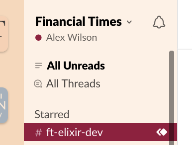

# FT Themer

A color-theme and distribution for [Themer](https://themer.dev),
built with the palette from the FT's [o-colors](https://registry.origami.ft.com/components/o-colors).

Why? I don't know. I like to have on-brand Slack/Chrome/other-multitenant-things.

Currently supports Google Chrome and Slack (with a custom renderer)

## Preview

## Using

1. `npm install`
2. `npm run build`

## I just want the Slack theme

here - https://slackthemes.net/#/custom#fff1e5,fff2e8,990f3d,fffcfa,990f3d,000000,990f3d,990f3d